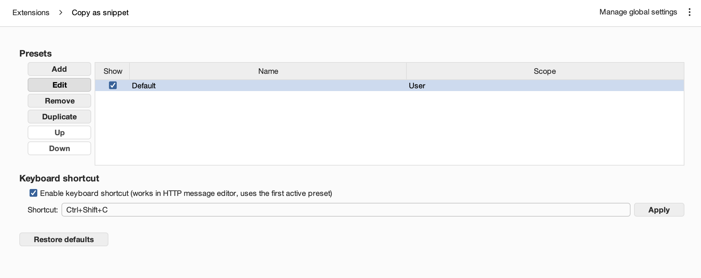
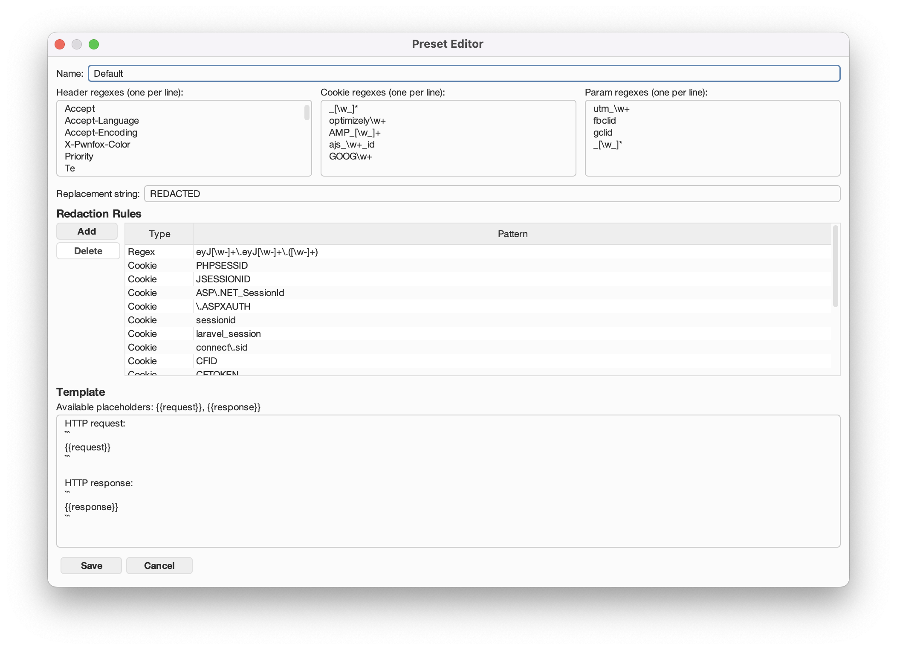

# Copy As Snippet for Burp Suite

Are you tired of removing junk headers and cookies from the PoCs copied from Burp? I know I am!

## Getting started
1. Install the latest release of the extension.
2. Go to Burp Settings > Extensions > Copy as snippet.
3. Check "Enable keyboard shortcut".

## Features

- Copy the request/response from the context menu in the text format
  - Automatic junk header/cookie removal
  - HTTP parameter removal (GET, POST forms, JSON)
  - JWTs and sensitive cookies are replaced with `REDACTED` (configurable via extension settings)
  - Select multiple requests from Proxy to report them all at once
- Configure a request editor hotkey to skip the context menu
- Supports multiple presets
  - All presets are shared between projects
  - Preset import/export

**Note**: The default junk header/cookie list is not meant to be universal. For example, you can completely ignore cache-related headers in one PoC, while in another one they will be essential. Create, use and share presets, and feel free to suggest changes via GitHub issues!

### Screenshots

## Building locally

Uses OpenJDK 21.0.10 with Gradle 9.3.1. To build your own copy, just run `gradle build` from the repository root, then grab the JAR from `build/libs/`.
